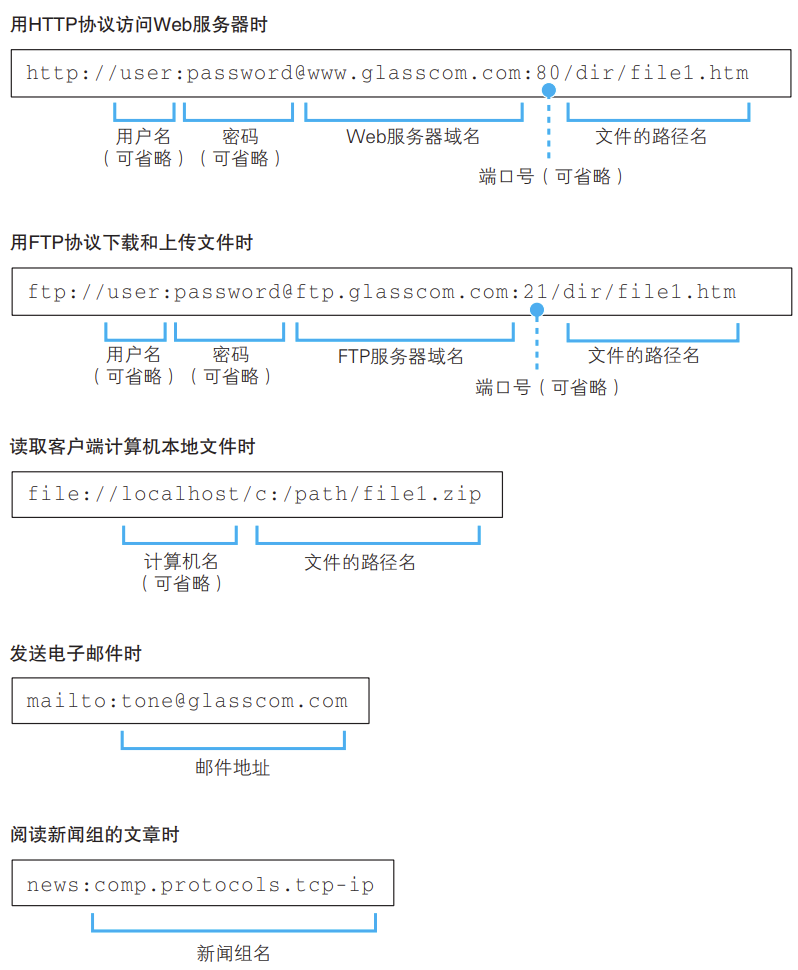
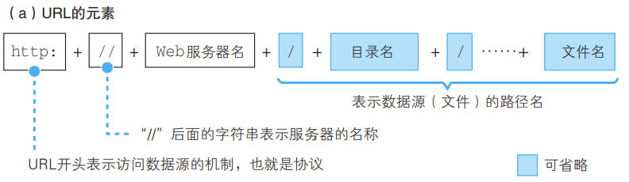
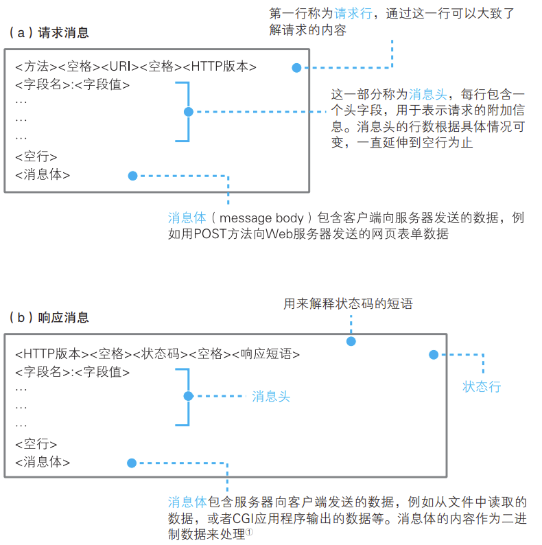

## 生成HTTP请求消息

浏览器具备多种客户端功能：访问Web服务器、在FTP服务器上传下载文件、电子邮件客户端。

因此，URL有不同类型：

在访问Web服务器时，浏览器首先需要解析URL，拆分成若干元素：

对于省略文件名或目录名的URL，如http://www.lab.glasscom.com/dir/或http://www.lab.glasscom.com/，服务器会事先设置好默认文件名，如index.html或default.htm等。

解析完成后，浏览器使用HTTP协议访问服务器。协议规定了双方交互的消息格式和步骤，请求消息包含方法、URI。URI表示“操作的目标文件或应用程序”，如/dir/file.html。方法表示“进行怎样的操作”，如GET/POST等。

请求行中的方法字段需要根据场景设定，显示网页/点击超链接使用GET，提交表单可以是GET(附加到URI后)，也可以是POST，需要与前端协商后设定，GET方法能够发送的数据只有几百KB，表单数据规模超出后必须使用POST。

浏览器收到响应消息后，如果只有文字则直接显示，流程结束。如果网页中包含图片标签，如，浏览器会在屏幕上留出图片的空间，再次请求服务器获取相应图片并显示在预留空间。由于每条请求消息只能包含1个URI，因此每张图片都需要单独请求1次。

## 向DNS服务器查询Web服务器的IP地址

